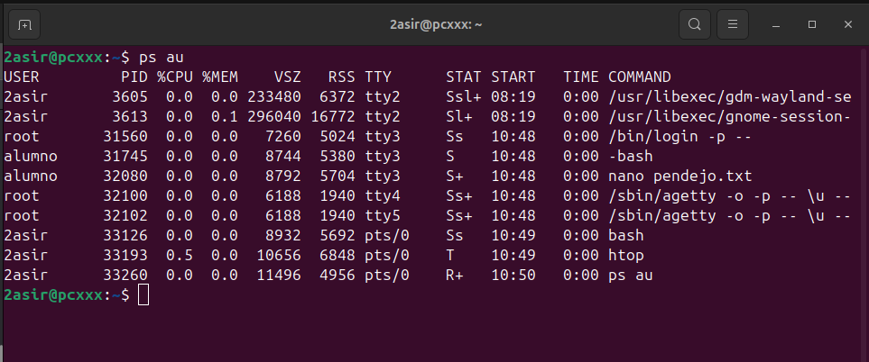

##  Procesos:

**Comando:**  
`ps aux`

**Explicación rápida:**  
Muestra una lista de los procesos que están corriendo en tu sistema actualmente, te muestra quién los está ejecutando, cuánta memoria y CPU usan.

**Captura:**  

