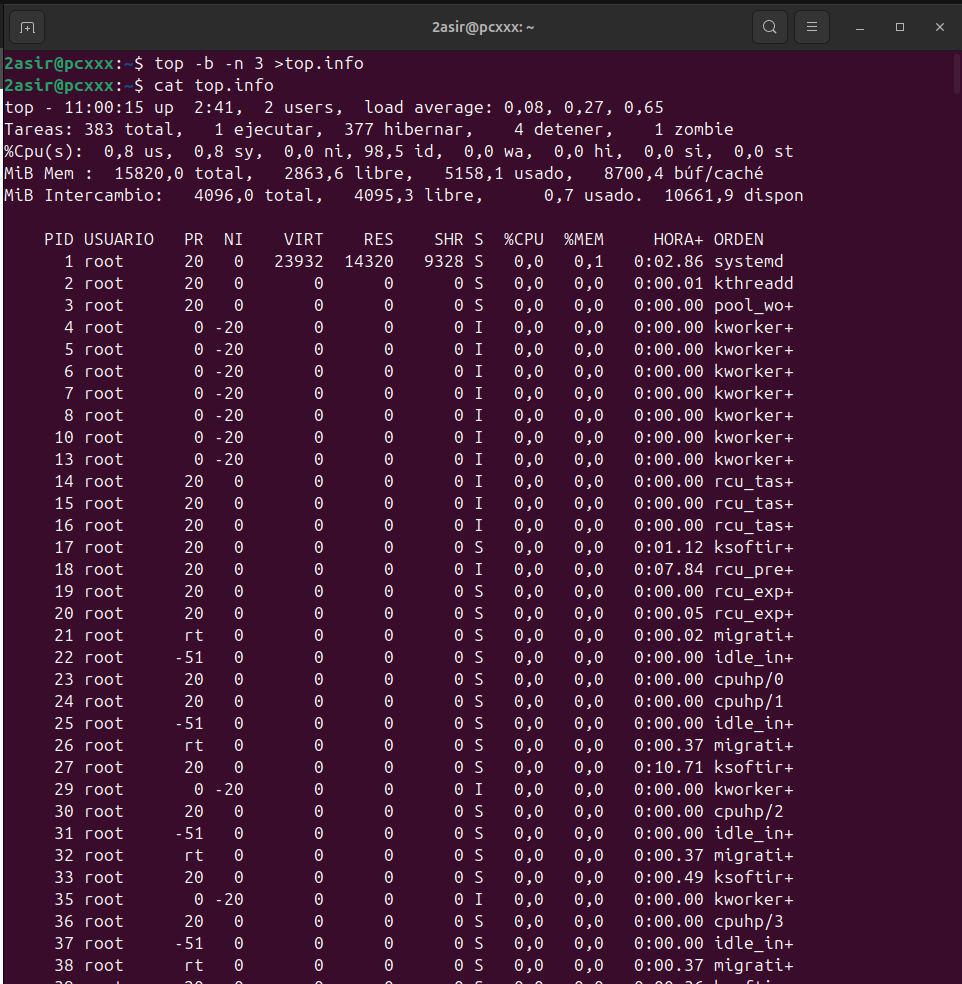
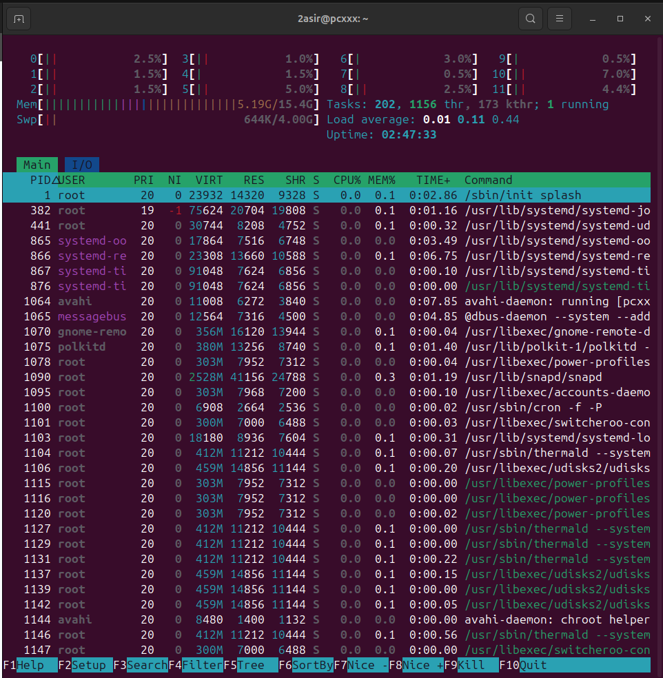
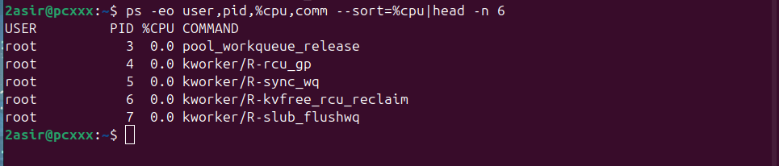

##  Procesos:

**Comando:**  
`ps au`

**Explicación rápida:**  
Muestra una lista de los procesos que están corriendo en tu sistema actualmente, te muestra quién los está ejecutando, cuánta memoria y CPU usan.

**Captura:**  

**Comando:**  
`ps aux`

**Explicación rápida:**  
Nos muestra **TODOS** los procesos del sistema, pero no sólo los nuestros, también muestra los de otros usuarios y los servicios que corran en segundo plano. 

**Captura:**  

**Comando:**  
`ps -u alumno`

**Explicación rápida:**  
Nos muestra los procesos que están siendo ejectuados por el usuario **alumno**, es bastante útil si queremos ver que tareas está ejectuando ese usuario, cuánta CPU está consumiendo o cuánta memoria está utilizando.

**Captura:**  

**Comando:**  
`top`

**Explicación rápida:**  
Nos muestra una pantalla en **tiempo real** de los procesos que están siendo ejecutados, se ordenan por el uso de CPU o de la memoria (es básicamente cómo un administrador de tareas de Windows).

**Captura:**  

**Comando:**  
`top -b -n 3 > top.info`

**Explicación rápida:**  
Este comando nos mostrará en pantalla en **tiempo real** los procesos que están siendo ejecutados y se guarda en un archivo llamado "top.info" (muy útil si queremos mandarlo a algún otro usuario).

**Captura:**  

**Comando:**  
`htop`

**Explicación rápida:**  
Es una manera más moderna y visual del comando "top", nos mostrará los procesos en tiempo real pero con colores, barras y una interfaz que se puede mover con el propio teclado (cómo filtrar usuarios o procesos).

**Captura:**  

---

## EJERCICIO PRÁCTICO

**Comando:**  
`ps -eo user,pid,%cpu,comm --sort=-%cpu | head -n 6`

**Explicación rápida:**  
Muestra los **5 procesos que más CPU usan**, junto con el **usuario**, el **PID**, el **porcentaje de CPU** y el **nombre del comando** que se está ejecutando.

**Captura:**  

