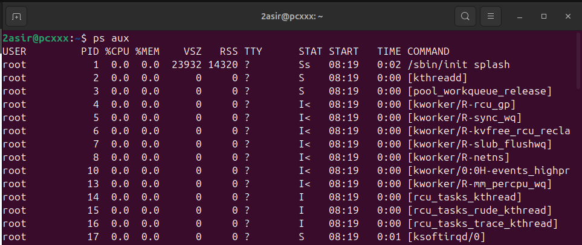
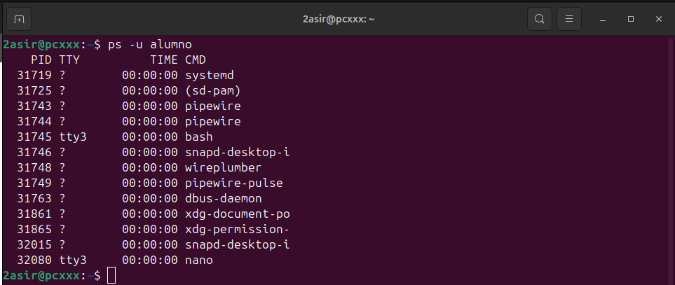
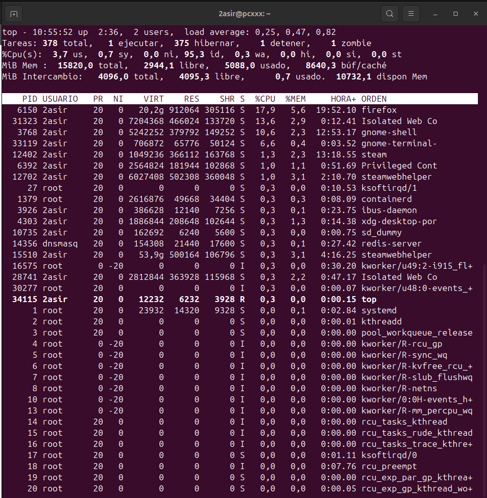

##  Procesos:

**Comando:**  
`ps au`

**Explicación rápida:**  
Muestra una lista de los procesos que están corriendo en tu sistema actualmente, te muestra quién los está ejecutando, cuánta memoria y CPU usan.

**Captura:**  

**Comando:**  
`ps aux`

**Explicación rápida:**  
Nos muestra **TODOS** los procesos del sistema, pero no sólo los nuestros, también muestra los de otros usuarios y los servicios que corran en segundo plano. 

**Captura:**  

**Comando:**  
`ps -u alumno`

**Explicación rápida:**  
Nos muestra los procesos que están siendo ejectuados por el usuario **alumno**, es bastante útil si queremos ver que tareas está ejectuando ese usuario, cuánta CPU está consumiendo o cuánta memoria está utilizando.

**Captura:**  

**Comando:**  
`ps -u alumno`

**Explicación rápida:**  
Nos muestra una pantalla en **tiempo real** de los procesos que están siendo ejecutados, se ordenan por el uso de CPU o de la memoria (es básicamente cómo un administrador de tareas de Windows).

**Captura:**  

