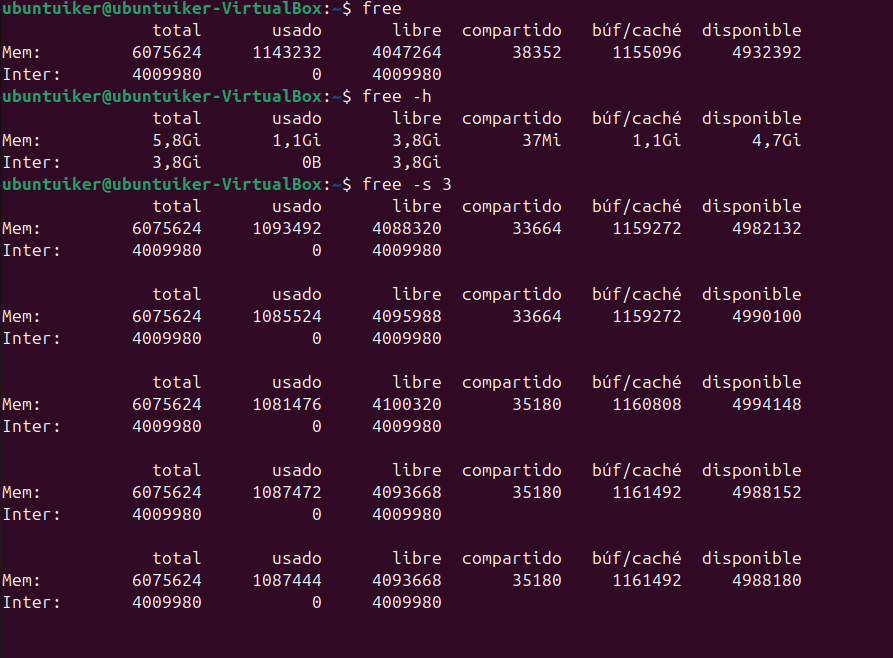
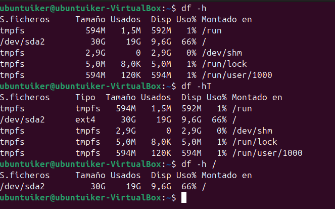
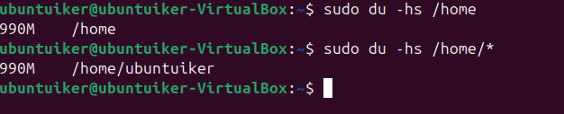

## Memoria y Rendimiento de disco

**Comandos 1:**  
`free | free -h | free -s 3`

**Explicación rápida:**  
Muestra una lista de los procesos que están corriendo en tu sistema actualmente, te muestra quién los está ejecutando, cuánta memoria y CPU usan.

**Captura:**  

**Comandos 2:**  
`df -h | df -hT | df -h /`

**Explicación rápida:**  
Muestra una lista de los procesos que están corriendo en tu sistema actualmente, te muestra quién los está ejecutando, cuánta memoria y CPU usan.

**Captura:**  

**Comandos 3:**  
`du -hs /home | du -hs /home/*`

**Explicación rápida:**  
Muestra una lista de los procesos que están corriendo en tu sistema actualmente, te muestra quién los está ejecutando, cuánta memoria y CPU usan.

**Captura:**  

