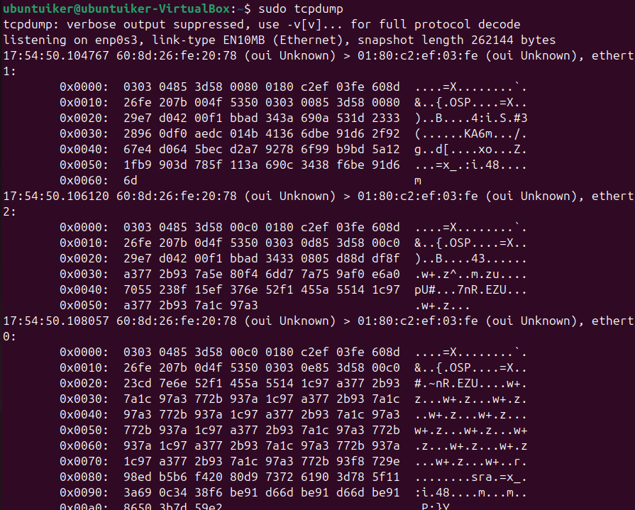
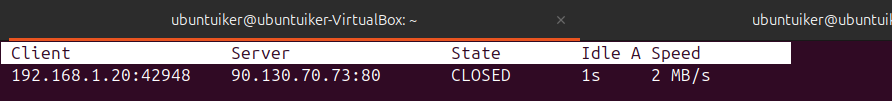
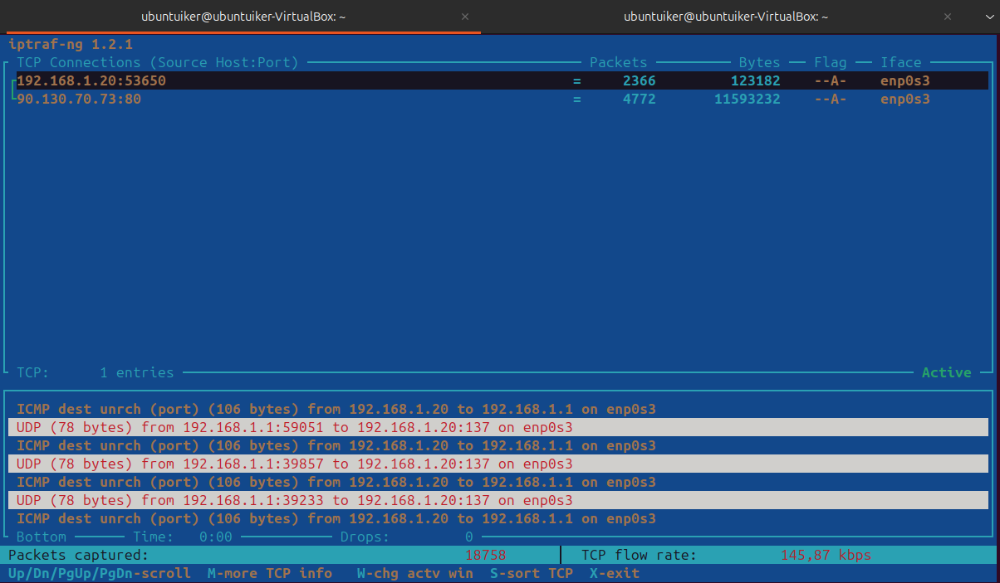
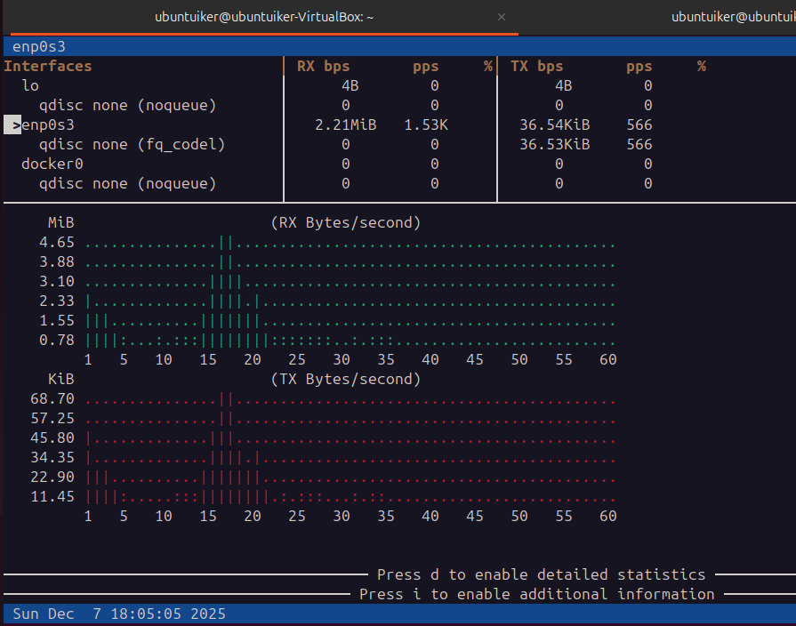

## Tráfico de red

**Comando 1:**  
`sudo tcpdump`

**Explicación rápida:**  
Captura el tráfico "en crudo" y te vuelca toda la información de los paquetes en pantalla para analizarla a fondo.

**Captura:**  

**Comando 2:**  
`tcptrack -i [TARJETA_DE_LA_RED`

**Explicación rápida:**  
Te muestra en vivo las conexiones que hay abiertas y la velocidad de cada una, útil para vigilar el consumo en tiempo real.

**Captura:**  

**Comando 3:**  
`iptraf`

**Explicación rápida:**  
Es un panel más completo con menús que te da estadísticas detalladas de los paquetes y conexiones de toda la red.

**Captura:**  

**Comando 4:**  
`bmon`

**Explicación rápida:**  
Saca unas gráficas en la terminal para ver de forma visual cuánto tráfico de subida y bajada estás teniendo en ese momento.

**Captura:**  

