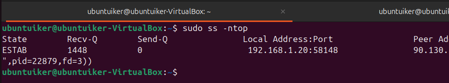
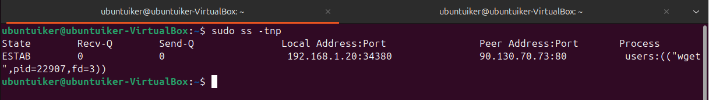
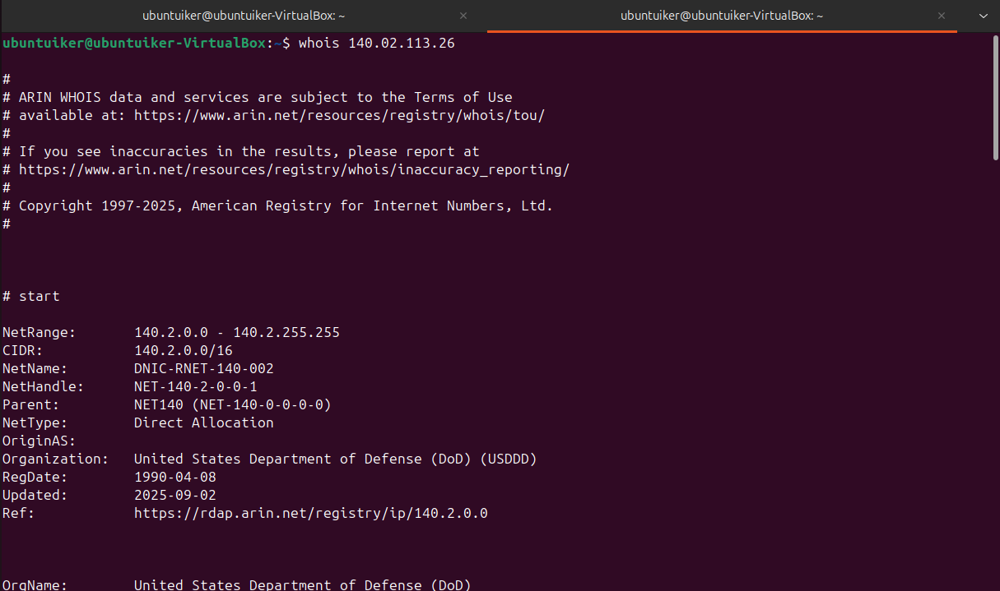
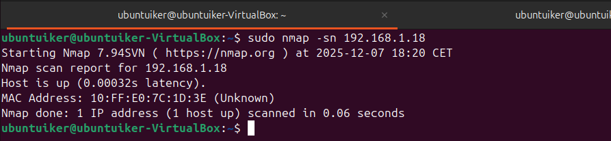
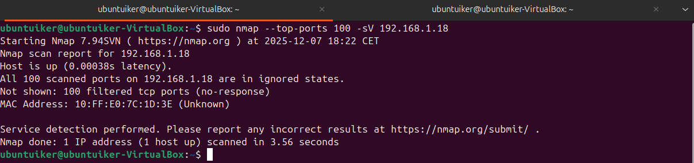

## Puertos

**Comando 1:**  
`ss -ntop`

**Explicación rápida:**  
Captura el tráfico "en crudo" y te vuelca toda la información de los paquetes en pantalla para analizarla a fondo.

**Captura:**  

**Comando 2:**  
`ss -tnp`

**Explicación rápida:**  
Captura el tráfico "en crudo" y te vuelca toda la información de los paquetes en pantalla para analizarla a fondo.

**Captura:**  

**Comando 3:**  
`whois [IP]`

**Explicación rápida:**  
Captura el tráfico "en crudo" y te vuelca toda la información de los paquetes en pantalla para analizarla a fondo.

**Captura:**  

**Comando 4:**  
`nmap -sn [IP]`

**Explicación rápida:**  
Captura el tráfico "en crudo" y te vuelca toda la información de los paquetes en pantalla para analizarla a fondo.

**Captura:**  

**Comando 5:**  
`nmap --top-ports 100 -sV [IP]`

**Explicación rápida:**  
Captura el tráfico "en crudo" y te vuelca toda la información de los paquetes en pantalla para analizarla a fondo.

**Captura:**  

