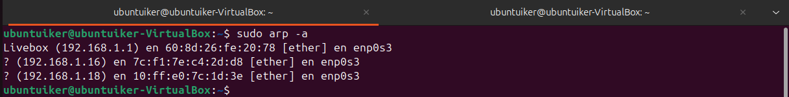

# Puertos

**Comando 1:**  
`ss -ntop`

**Explicación rápida:**  
Te lista las conexiones TCP con las IPs en número (sin traducir a nombres), mostrando los timers y qué proceso exacto las abrió

**Captura:**  

**Comando 2:**  
`ss -tnp`

**Explicación rápida:**  
Prácticamente igual que el anterior, pero te quita la columna de los "timers" para que la salida sea más limpia y fácil de leer.

**Captura:**  

**Comando 3:**  
`whois [IP]`

**Explicación rápida:**  
Es como pedir el DNI de una IP pública: te dice a qué empresa pertenece (Google, Amazon, etc.) y dónde están registrados

**Captura:**  

**Comando 4:**  
`nmap -sn [IP]`

**Explicación rápida:**  
Hace un barrido rápido solo para ver qué máquinas están encendidas (host up) sin perder tiempo escaneando puertos

**Captura:**  

**Comando 5:**  
`nmap --top-ports 100 -sV [IP]`

**Explicación rápida:**  
Revisa solo los 100 puertos más típicos para ir rápido e intenta averiguar qué versión exacta de software corre ahí.

**Captura:**  

**Comando 6:**  
`arp -a`

**Explicación rápida:**  
Te enseña la "agenda" local de tu PC: la lista de dispositivos con los que ha hablado recientemente (IP asociada a su MAC)

**Captura:**  

